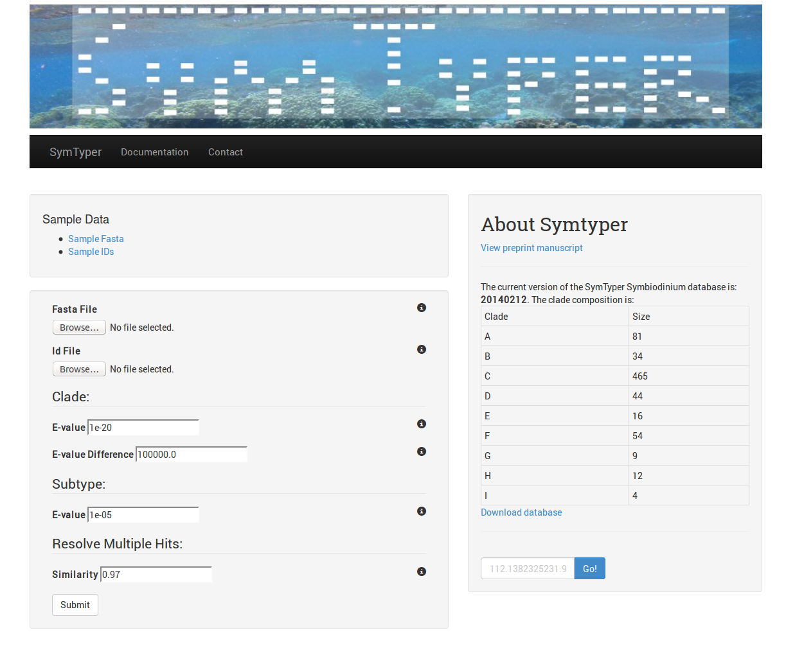
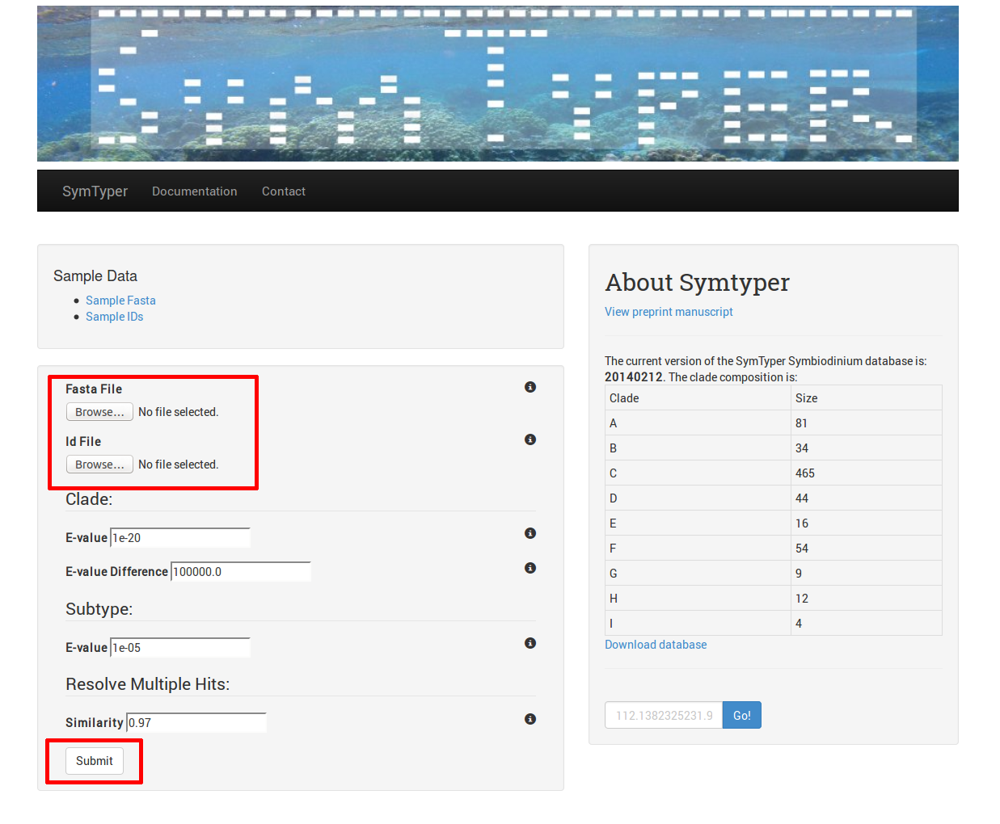
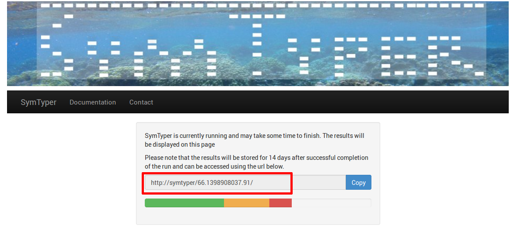
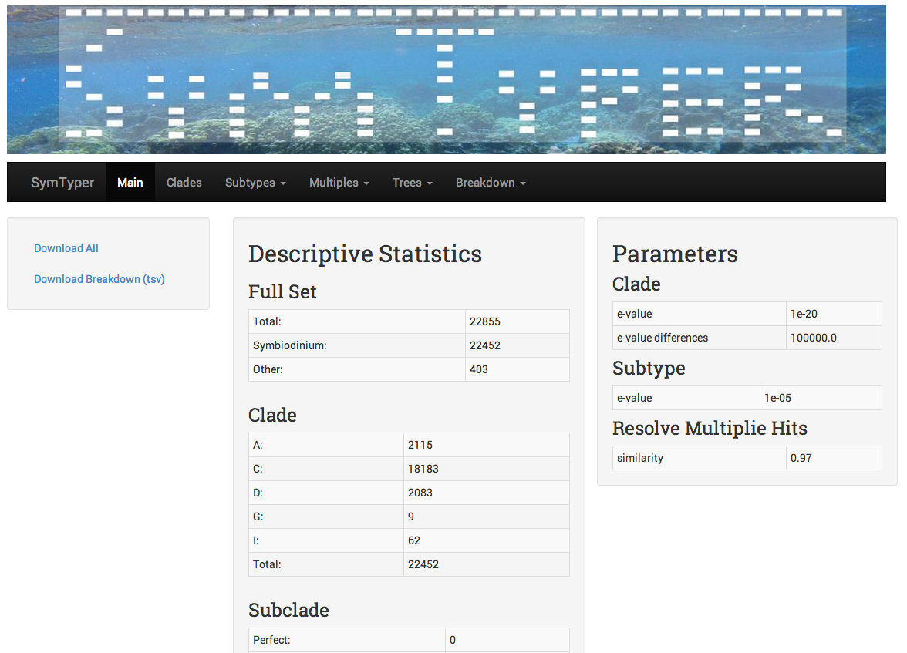
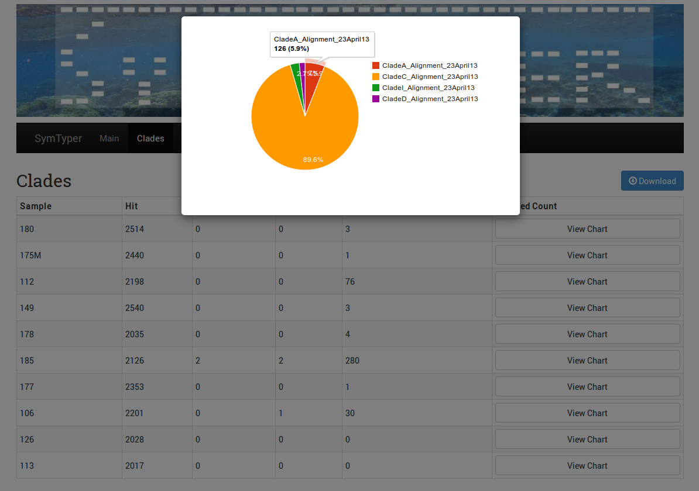
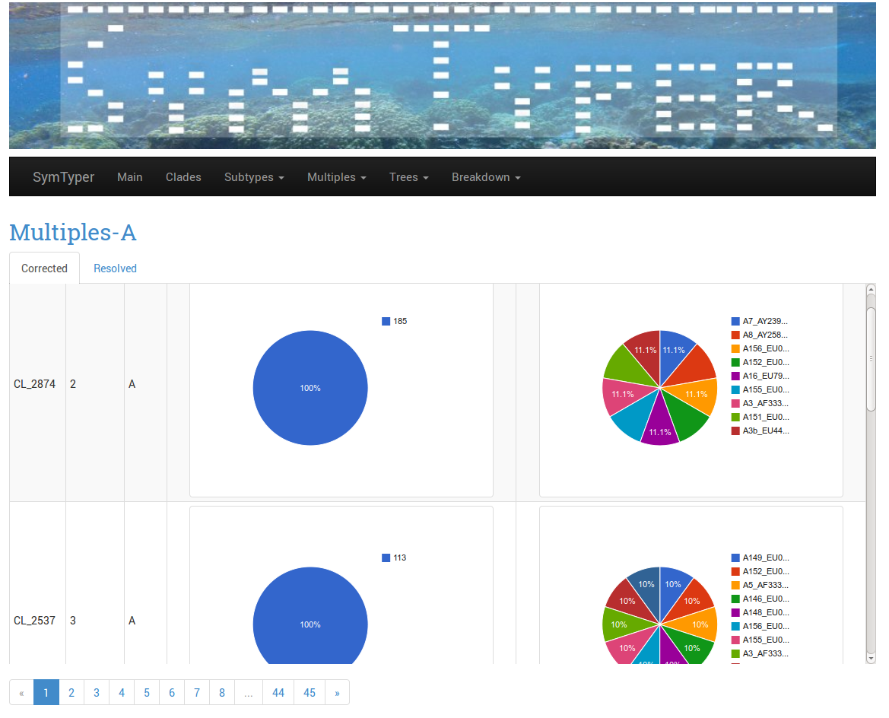
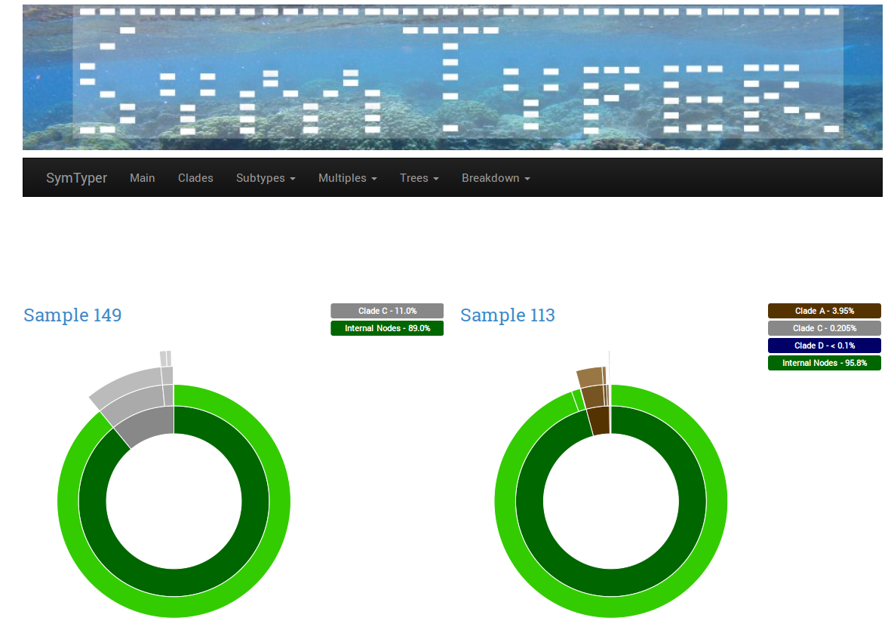

Web-based Symtyper 
==================

Brief Overview
--------------
To run Symtyper from the web, follow these instructions:

First, invoke symtyper main submission page. You should be presented with the following page in Figure 1.

   Symtyper's Main Screen

To submit a new analysis, browse and select your input fasta file and a valid  ids file and then click submit.

   Submitting a New SymTyper Analysis

The next screen will provide you with the URL where the output can be accessed.
Depending on the input size, the processing can take between few minutes to hours.
Please copy the URL for future access. Job will be hosted on the Symtyper Site for 15 days.

   Processing Screen and Job URL

If the anlysis completed successfully, you should be presented with
the a summary table where the various componenents of the analysis
can be accesses. The results are gouped by section; Clases, Subtypes, Multiples, Trees, Breakdown. These sections are explained below.
   

.. _main_results_page:

   SymTyper Results Main Screen

==================   ============
Section              Definication
==================   ============
Clades		     Shows the breakdown of clades per sample. The results can be viewed or download as a matrix or show as a piechart per sample.
Subtypes	     Shows the breakdowns of sybtypes per sample. The results can be viewed independently for the perfect, unique and  ShortNew subtypes. 
		     The difference between these three categories is described  :ref:`unique`.
Multiples	     This graphs shows the disctribution of sequences for each clade contaning multiple hits. The definition of a Multiple hits is described in the :ref:`multiples` section
Trees		     Described the breakdown of number of sequences assigned to internal nodes of the tree the clde tree per sample. The tree representation show the combined counts for all
		     the samples  
Breakdown	     Shows the Sunburst represrntation of Clade and sutypes by Tree
==================   ============

Clades View
+++++++++++++

The Clades View shows a table view of the distribution of HITS,
NOHITS, LOW and AMBIGUOUS hits per sample.  Clicking the View Chart
provides access to the clades distribution for each sample. The
complete results and disbtribution of clades per sample can be
downloaded from the results main page (see :ref:`main_results_page`).

   
   Pie Chart Distribution of Clade per Sample

Subtypes View 
+++++++++++++++

This Subtypes Views shows the breakdown of sybtypes per sample. The results
can be viewed independently for the :ref:`perfect`, :ref:`unique` and the
:ref:`ShortNew` subtypes. The subtypes are assigned based on the blast results of the query sequences to
the clade specific references. 

.. figure:: _static/subtypes.png
   :scale: 60%
   :alt: Subtypes view
   :align: center
   
   Subtypes Distribution per Clade

=========   ==============================================================================================================================================================================
=========   ==============================================================================================================================================================================
Perfect     A query sequence that aligns perfectly or with very high similarity to a unique symbiont reference in the database (e.g., 100% similarity to 100% of the length of the target) 
Unique 	    A query sequence that aligns umabiguously to symbiont reference in the database. (e.g., :math:`>=` user defined % 
	    similarity to 100% target length and the bit score for the best hit is at least 3 orders or magnitude larger than than that for the second hit); 
ShortNew    A query sequence shorer than the average sequence in the reference database 
	    but which aligns with high similarity to a unique reference according to the dynamic similarity threshold (See :ref:`dynamic_similarity`) 
=========   ==============================================================================================================================================================================

Multiples View
++++++++++++++++

The Multiples View is a graphical representation of corrected sybtypes
counts to which ambiguous sequences map. The algortihm used to
resolved multiple hits is described in the :ref:`multiple_hits` and
detailed in the manuscript.

   Sybtypes Distribution for the Corrected Ambiguous Hits

The breakedown of subtypes for :ref:`resolved` under the "Resolved tab"

Trees View
++++++++++

   Distribution of Ambiguous Sequences in the Clade Phylogeny.

For each clade phylogeny, this view compiles the number the number the
number of time an :ref:`mrca` was identified for an ambiguous sequence
(after the :ref:`multiple_hits` stage). The tree can downloaded in the
Newick format and viewed or parsed in phylogeny applications. A matrix
file comparing results across samples can be be found in output
archive available for download from the main page.

Breakdown View
++++++++++++++

This view summarizes using a Sunburst visualizaiton  the intricate structure of
 Symbiodinium clades and subtypes in a single or between two samples,
 through a user-friendly graphical representations names
 Sunburst. Highlighting a level of the Sunburst charts diplay its
 structure and the percentage of sample reads assigns to it.

